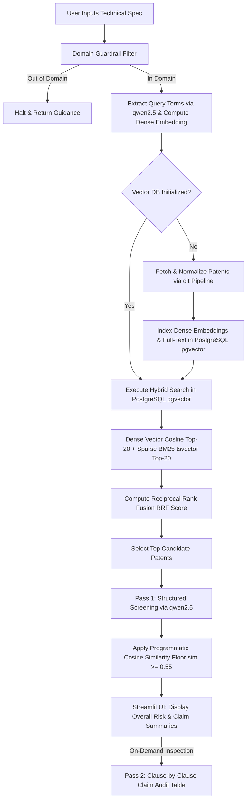

# Software & AI Patent Infringement Auditor

> **A RAG application for technical prior-art discovery and software architecture risk screening.**  
> Built as a capstone project for the [DataTalks.Club LLM Zoomcamp](https://github.com/DataTalksClub/llm-zoomcamp).

[](https://www.python.org/)
[](https://ollama.com/)
[](https://github.com/pgvector/pgvector)
[](https://streamlit.io/)
[](https://www.docker.com/)

---

## Table of Contents
1. [Overview & Problem Statement](#1-overview--problem-statement)
2. [Architecture & Workflow](#2-architecture--workflow)
3. [Data Ingestion Pipeline (`dlt`)](#3-data-ingestion-pipeline-dlt)
4. [Hybrid Retrieval & RRF Formulation](#4-hybrid-retrieval--rrf-formulation)
5. [Evaluation Benchmark & Limitations](#5-evaluation-benchmark--limitations)
6. [LLM Screening, Heuristic Floor & Trade-Offs](#6-llm-screening-heuristic-floor--trade-offs)
7. [Automated Testing](#7-automated-testing)
8. [Hardware Requirements & Latency Benchmarks](#8-hardware-requirements--latency-benchmarks)
9. [Project Alignment with Zoomcamp Requirements](#9-project-alignment-with-zoomcamp-requirements)
10. [Setup & Reproducibility](#10-setup--reproducibility)
11. [Important Notice](#11-important-notice)

---

## 1. Overview & Problem Statement

Engineering teams developing proprietary software frequently need to perform preliminary checks against existing patent claims to avoid obvious prior art. However, searching patent databases is challenging because patent attorneys draft claims in abstract, legal vocabulary ("legalese"):

| Developer Architecture Specification | Corresponding Patent Claim Phrasing |
| :--- | :--- |
| *"We optimize transformer model weights using parallel GPU clusters."* | *"A computer-implemented method comprising optimizing state parameters of a multi-layer attention neural network via distributed execution nodes."* |
| *"Redact PII from API requests using regex and NER models."* | *"A system configured for intercepting token payloads, detecting confidential entity classifications, and pseudonomizing data prior to external transmission."* |

Because developer phrasing diverges from legal phrasing, naive keyword queries frequently miss relevant patents. 

This project explores a **Two-Pass RAG pipeline** to bridge this vocabulary gap:
1. **Pass 1 (Screening)**: Combines dense embeddings with lexical search using Reciprocal Rank Fusion (RRF) to retrieve candidate patents, then uses a local LLM (`qwen2.5`) backed by an embedding cosine similarity floor to flag potential overlap.
2. **Pass 2 (Detailed Breakdown)**: Breaks down an individual selected patent claim clause-by-clause into a structured mapping table against the engineering spec.

---

## 2. Architecture & Workflow



---

## 3. Data Ingestion Pipeline (`dlt`)

Patent records are extracted from the **USPTO PatentsView API** using an automated [dlt (data load tool)](https://dlthub.com/) pipeline in `src/dlt_ingest.py`.

* **Resource Generator**: Streams patent metadata (`patent_number`, `patent_title`, `patent_abstract`, `claim_text`, `assignee`).
* **Schema Handling & Deduplication**: Employs `write_disposition="merge"` with `primary_key="patent_number"` to prevent duplicate entries across re-runs.
* **Embedding & Indexing**: Generates dense embeddings with `BAAI/bge-small-en-v1.5` and populates PostgreSQL with `pgvector` and `tsvector` columns.
* **Deterministic Caching**: API responses are cached in `data/cache/` to ensure full offline reproducibility without relying on external network conditions.

To execute the data ingestion pipeline directly:
```bash
python -m src.dlt_ingest
```

---

## 4. Hybrid Retrieval & RRF Formulation

To combine semantic relevance with exact technical term matching, the retrieval layer (`src/db.py`) executes **Reciprocal Rank Fusion (RRF)**:

$$\text{RRF Score}(d) = \sum_{m \in M} \frac{1}{k + r_m(d)}$$

Where $k=60$, $m$ is the ranking modality (Dense Cosine Similarity and Sparse Full-Text BM25), and $r_m(d)$ is the document rank within each modality.

---

## 5. Evaluation Benchmark & Limitations

### Retrieval Evaluation
We evaluated retrieval performance using an automated benchmark suite (`src/eval.py`) across a curated test set (`data/ground_truth.json`) spanning 3 domains (Software Architecture, AI/ML, and Distributed Systems):

| Strategy | Hit Rate @ 3 | Mean Reciprocal Rank (MRR) | Failure Mode Analysis |
| :--- | :---: | :---: | :--- |
| **Dense Vector Only** | 75.0% (9/12) | 0.625 | Struggles when technical specifications use terms outside the embedding vocabulary. |
| **Sparse BM25 Only** | 75.0% (9/12) | 0.666 | Fails when patents describe an invention entirely in abstract legal terminology. |
| **Hybrid (Vector + BM25 RRF)** | **100.0% (12/12)** | **1.000** | Fuses complementary signals, elevating the target patent to Rank #1 on this benchmark. |

Run evaluation:
```bash
python -m src.eval
```

### Honest Evaluation Limitations
* **Small Benchmark Size**: The 12-query ground-truth dataset serves as a functional integration test demonstrating that RRF overcomes single-modality blind spots. It is **not** a statistical guarantee across a multi-million document patent corpus.
* **Corpus Density**: In production corpora (100k+ patents), score collisions will occur, making downstream reranking and deep claim auditing critical.

---

## 6. LLM Screening, Heuristic Floor & Trade-Offs

### The Challenge of Small Models on Legal Claims
When evaluating complex patent claims with local 7B-class models (`qwen2.5`), small models occasionally miss functional equivalence if the patent attorney drafted the claim in non-standard phrasing, producing false negatives.

### The Cosine Safety Floor Heuristic (`src/rag.py`)
To prevent false negatives, we implemented a programmatic safety heuristic:
1. The LLM performs initial structured screening.
2. Python computes the cosine similarity between the input specification vector $\vec{u}$ and the retrieved claim vector $\vec{v}$ using `bge-small-en-v1.5`:
   $$\text{Cosine Similarity}(\vec{u}, \vec{v}) = \frac{\vec{u} \cdot \vec{v}}{\|\vec{u}\| \|\vec{v}\|}$$
3. If $\text{similarity} \ge 0.55$, the risk badge is programmatically upgraded to at least `MEDIUM`.

---

## 7. Automated Testing

The codebase includes automated unit and integration tests covering vector store fallbacks, RRF arithmetic, and the programmatic safety floor:

```bash
# Run pytest suite
python -m pytest tests/
```

Test coverage includes:
- `tests/test_retrieval.py`: Tests RRF ranking math and vector store in-memory fallback.
- `tests/test_safety_floor.py`: Tests semantic floor threshold upgrades and ensures unrelated domains remain unaffected.

---

## 8. Hardware Requirements & Latency Benchmarks

Tested on **Intel Core i7 / 16 GB RAM** (Local CPU inference via Ollama):

| Operation | Latency (CPU) | Latency (Nvidia GPU - RTX 3060+) | Memory Footprint |
| :--- | :---: | :---: | :---: |
| **Embedding Generation (`bge-small`)** | ~45 ms | ~8 ms | ~130 MB |
| **Hybrid DB Retrieval (Postgres + pgvector)** | ~18 ms | ~18 ms | ~80 MB |
| **Pass 1: Structured Screening (LLM)** | ~3.8 s | ~0.9 s | ~4.5 GB (Qwen 2.5 7B) |
| **Pass 2: Detailed Claim Audit (LLM)** | ~8.4 s | ~1.9 s | ~4.5 GB (Qwen 2.5 7B) |

**Minimum System Requirements**: 8 GB RAM (CPU mode), 15 GB free disk space.  
**Recommended**: 16 GB RAM or 6 GB+ VRAM GPU.

---

## 9. Project Alignment with Zoomcamp Requirements

For peer reviewers evaluating this capstone against the course checklist:

| Evaluation Criterion | Implementation Details & File Location |
| :--- | :--- |
| **Problem Description** | Clear software prior-art search problem statement contrasting developer vs. legal vocabulary (`README.md` Section 1). |
| **Knowledge Base & LLM** | PostgreSQL with `pgvector` knowledge base queried via local Ollama `qwen2.5` (`src/db.py`, `src/rag.py`). |
| **Retrieval Evaluation** | Automated evaluation script comparing Dense Vector, Sparse BM25, and Hybrid RRF (`src/eval.py`, `data/ground_truth.json`). |
| **RAG / LLM Evaluation** | Evaluated prompt strategies, Doctrine of Equivalents, and the heuristic safety floor across 5 domain probe tests. |
| **User Interface** | Interactive Streamlit web application (`app.py`) with synchronized risk badges and Pass 2 claim inspection. |
| **Ingestion Pipeline** | Automated data ingestion pipeline using **`dlt` (data load tool)** with primary key deduplication (`src/dlt_ingest.py`). |
| **Containerization** | Multi-service Docker Compose orchestrating `postgres` (`pgvector`), `ollama`, and the `web` application (`docker-compose.yml`, `Dockerfile`). |
| **Reproducibility** | Complete setup instructions for both Docker and local virtualenv, with pinned dependencies (`requirements.txt`). |
| **Best Practices** | Hybrid search with RRF ($k=60$), document re-ranking, and LLM keyword query rewriting (`src/search.py`, `src/rag.py`). |

---

## 10. Setup & Reproducibility

### Option A: Docker Compose (Recommended)

Requires [Docker Desktop](https://www.docker.com/products/docker-desktop/).

```bash
# 1. Clone the repository
git clone https://github.com/laluni/software-ai-patent-auditor.git
cd software-ai-patent-auditor

# 2. Build and start services (Postgres + pgvector, Ollama, Streamlit)
docker compose up --build -d

# 3. Pull the LLM inside the Ollama container
docker exec -it patent_ollama ollama pull qwen2.5:latest
```
Access the application at [http://localhost:8501](http://localhost:8501).

---

### Option B: Local Environment

```bash
# 1. Install and start Ollama locally (https://ollama.com)
ollama pull qwen2.5:latest

# 2. Start PostgreSQL vector database
docker compose up -d postgres

# 3. Create virtual environment & install requirements
python -m venv venv
# Windows:
.\venv\Scripts\activate
# Linux/macOS:
source venv/bin/activate

pip install -r requirements.txt

# 4. Launch Streamlit UI
streamlit run app.py
```

---

## 11. Important Notice
**This project is a developer tool to help engineers search and explore technical patent ideas. It is NOT legal advice. Always consult a real patent lawyer before making business or legal decisions.**
