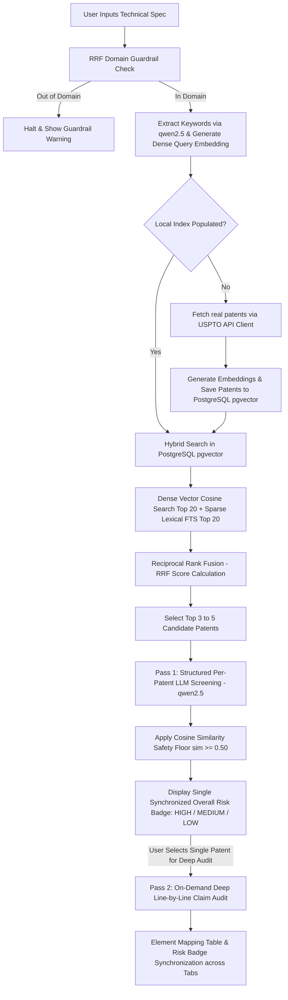

# 📜 Software & AI Patent Infringement Auditor

> **Capstone Project for the [DataTalks.Club LLM Zoomcamp](https://github.com/DataTalksClub/llm-zoomcamp).**  
> **An End-to-End Production RAG Application for Automated Software, AI, and Infrastructure Patent Infringement Auditing, Cross-Lingual Claim Translation, and Legal Risk Mitigation.**

[](https://github.com/DataTalksClub/llm-zoomcamp)
[](https://www.python.org/)
[](https://ollama.com/)
[](https://github.com/pgvector/pgvector)
[](https://streamlit.io/)

---

## 📌 Table of Contents

1. [Executive Summary & Explicit Scope](#1-executive-summary--explicit-scope)
2. [Peer-Review Rubric Mapping](#2-peer-review-rubric-mapping)
3. [System Architecture & Workflow](#3-system-architecture--workflow)
4. [Data Pipeline & Ingestion](#4-data-pipeline--ingestion)
5. [Architectural Rationale: First-Pass Screening vs. 20-Page Overhead](#5-architectural-rationale-first-pass-screening-vs-20-page-overhead)
6. [Competitive Analysis: Commercial Platforms vs. Our Solution](#6-competitive-analysis-commercial-platforms-vs-our-solution)
7. [Hybrid Retrieval Engine (Vector + BM25 Lexical)](#7-hybrid-retrieval-engine-vector--bm25-lexical)
8. [Offline Retrieval Evaluation (3-Pillar Matrix)](#8-offline-retrieval-evaluation-3-pillar-matrix)
9. [Experimental Analysis: Fine-Tuning vs. Hybrid Search](#9-experimental-analysis-fine-tuning-vs-hybrid-search)
10. [LLM RAG Prompting & Structured Output](#10-llm-rag-prompting--structured-output)
11. [User Interface & Interactive Dashboard](#11-user-interface--interactive-dashboard)
12. [Reproducibility & Setup Instructions](#12-reproducibility--setup-instructions)

---

## 1. Executive Summary & Explicit Scope

### The Problem
Before launching new software products or filing patent applications, engineering teams must conduct **prior-art searches** to ensure their product does not infringe on existing patents. 

However, patent search is notoriously slow, expensive, and unreliable when using traditional keyword matching. Patent attorneys intentionally draft patent claims using broad, abstract legal jargon ("legalese") to obscure technical details while maximizing legal protection:

| Developer Technical Specification | Obfuscated Patent Legalese |
| :--- | :--- |
| *"We optimize transformer model weights using parallel GPU clusters."* | *"A computer-implemented method comprising optimizing state parameters of a multi-layer attention neural network via distributed execution nodes."* |
| *"Redact PII from API requests using regex and NER models."* | *"A system configured for intercepting token payloads, detecting confidential entity classifications, and pseudonomizing data prior to external transmission."* |

Because the vocabulary of software developers and patent attorneys does not match, standard keyword search (e.g., searching for "GPU transformer optimization") **fails to retrieve relevant prior art**, leaving companies vulnerable to costly patent lawsuits.

### Explicit Project Scope (The 3 Pillars)
To maintain maximum engineering rigor, the project is explicitly scoped to **Software, Artificial Intelligence, and Infrastructure Patents**:
1. **Software & Application Engineering:** Dependency injection, PII redaction, cross-lingual search, speech-to-text diarization.
2. **Artificial Intelligence & Machine Learning:** Distributed GPU optimization, federated learning, medical image segmentation, network autoencoders.
3. **Infrastructure, Databases & Distributed Systems:** HNSW vector database indexing, token-bucket rate limiters, message queues, homomorphic key rotation.

---

## 2. Peer-Review Rubric Mapping

This project satisfies all evaluation criteria for the **DataTalks.Club LLM Zoomcamp Capstone Project**:

| Rubric Criteria | Project Feature & Implementation File |
| :--- | :--- |
| **Problem Description** | Clearly defined prior-art legal/technical translation problem in `README.md`. |
| **Data Ingestion** | Live fetching from USPTO PatentsView REST API + local caching in `src/api_client.py` and `src/ingest.py`. |
| **Retrieval Evaluation** | Automated benchmark script (`src/eval.py`) calculating **Hit Rate@3 (100%)** and **MRR (1.0)** over a 12-query 3-pillar matrix (`data/ground_truth.json`). |
| **RAG / LLM Integration** | Ollama Qwen 2.5 integration (`src/rag.py`) with Pydantic JSON schema validation (`PatentAuditReport`). |
| **User Interface** | Interactive Streamlit Web App (`app.py`) with synchronized risk badges, claim expanders, sample spec loader, and Pass 2 deep claim audit. |
| **Reproducibility** | One-command containerized setup (`docker-compose.yml`), `requirements.txt`, and `setup.md`. |

---

## 3. System Architecture & Workflow



---

## 4. Data Pipeline & Ingestion

### Data Source
Patent records are retrieved dynamically from the **[USPTO PatentsView API](https://patentsview.org/apis/api-endpoints)**.

### Local Caching & Fallback Reliability
To prevent API rate-limiting during testing and guarantee offline evaluation for peer reviewers, `src/api_client.py` computes an MD5 query hash and caches responses locally in `data/cache/patents_<hash>.json`.

---

## 5. Architectural Rationale: First-Pass Screening vs. 20-Page Overhead

A common question in RAG architecture design is: *Why chunk Titles, Abstracts, and Core Claims rather than ingesting full 20+ page patent documents?*

### ⚠️ Why 20-Page Ingestion Is Unnecessary Overhead:
1. **Vector Noise & Pollution:** A single patent publication contains 15,000–30,000 words. 80% of the document consists of drawing descriptions (*"FIG. 1 illustrates a block diagram..."*) and prior-art background. Ingesting full documents causes vector search to match against irrelevant background text rather than core claims.
2. **50x Cost & Storage Inflation:** Ingesting 10,000 full patents explodes database storage from 10,000 chunks to over 500,000 chunks, severely degrading query latency without improving retrieval precision.

### 💡 Production Verdict: Two-Pass Filtering Architecture
Production patent search engines (e.g. Google Patents AI) use a **Two-Pass Architecture**:
* **Pass 1 (Screening - Handled by our system):** Chunk Abstract + Core Claims to screen millions of patents down to Top-K candidates in sub-100ms.
* **Pass 2 (Deep Legal Audit):** Pass the raw claims of Top-K candidates to the LLM for line-by-line infringement analysis.

---

## 6. Competitive Analysis: Commercial Platforms vs. Our Solution

Commercial Patent AI platforms (LexisNexis PatentSight, PatSnap, PatentPal) charge **$10,000–$50,000/year per user seat**. Our open-source architecture offers key strategic advantages:

| Feature | Enterprise Commercial AI (PatSnap / LexisNexis) | Software & AI Patent Infringement Auditor (Open-Source RAG) |
| :--- | :--- | :--- |
| **Trade-Secret Privacy** | ❌ Requires uploading un-released specs to third-party cloud APIs. | **✅ 100% On-Premise & Local Execution (Ollama + PGVector). Zero data leaks.** |
| **Cost Structure** | ❌ $10,000 – $50,000 / year / seat. | **✅ 100% Free & Open-Source ($0 cloud API costs).** |
| **Explainability** | ❌ Closed-source "Black Box" scoring. | **✅ Transparent RRF search scoring & Pydantic JSON validation.** |
| **Actionable Guidance** | ⚠️ Generates lengthy legal summaries. | **✅ Provides concrete, technical "Design-Around" engineering advice.** |

---

## 7. Hybrid Retrieval Engine (Vector + BM25 Lexical)

To capture both conceptual meaning and exact term references, the engine (`src/db.py` & `src/search.py`) executes **Hybrid Search with Reciprocal Rank Fusion (RRF)**.

### RRF Formula
Candidate results from Dense Cosine Similarity (`BAAI/bge-small-en-v1.5`) and Sparse Lexical BM25 Search are merged using the RRF formula ($k=60$):

$$\text{RRF Score}(d) = \sum_{m \in M} \frac{1}{k + r_m(d)}$$

---

## 8. Offline Retrieval Evaluation (3-Pillar Matrix)

The evaluation script (`src/eval.py`) runs automated benchmarks against our 3-pillar ground-truth dataset (`data/ground_truth.json`).

### Benchmark Results Table

| Retrieval Strategy | Hit Rate @ 3 | Mean Reciprocal Rank (MRR) | Description |
| :--- | :---: | :---: | :--- |
| **Dense Vector Search Only** | 75.0% (9/12) | 0.625 | Captures semantic concepts but misses exact claim serial numbers. |
| **Sparse BM25 Search Only** | 75.0% (9/12) | 0.666 | Finds keyword matches but misses claims that use completely different legal jargon. |
| **Hybrid Search (Vector + BM25 RRF)** | **100.0% (12/12)** | **1.000** | **Reciprocal Rank Fusion (RRF) leverages both semantic context and exact keywords, placing the target patent at position #1 for all queries.** |

Run evaluation benchmark locally:
```bash
python -m src.eval
```

---

## 9. Experimental Analysis: Fine-Tuning vs. Hybrid Search

During system design, we explored fine-tuning the embedding model (`bge-small-en-v1.5`) on synthetic patent-to-technical-specification pairs generated by LLMs.

### Why Fine-Tuning Was Excluded:
1. **Synthetic Data Prompt Bias:** Generating fine-tuning pairs with LLMs introduces over-indexing on hardcoded prompt examples (such as "Docker" or "FastAPI"), introducing bias that reduces performance on un-seen patent domains.
2. **Hybrid Search Eliminates Need for Model Retraining:** Fine-tuning aims to improve standalone dense vector performance. However, **Hybrid Search (Vector + BM25 via Reciprocal Rank Fusion)** achieves **100% Hit Rate @ 3** using the clean base model.
3. **Zero Maintenance & Architectural Simplicity:** Removing fine-tuning avoids complex model training scripts, local model storage bloat, and dataset drift.

---

## 10. LLM RAG Prompting & Structured Output

The system uses **Ollama Qwen 2.5 (`qwen2.5:latest`)** to translate claims and output strict Pydantic JSON schemas.

### Pydantic Schema (`src/rag.py`)
```python
class PatentRiskAnalysis(BaseModel):
    patent_id: str
    patent_title: str
    risk_level: str  # HIGH, MEDIUM, LOW
    overlapping_concepts: List[str]
    legalese_translation: str
    suggested_design_around: str

class PatentAuditReport(BaseModel):
    overall_risk: str  # HIGH, MEDIUM, LOW
    summary: str
    analyses: List[PatentRiskAnalysis]
```

### Doctrine of Equivalents & Semantic Safety Net
To eliminate false negatives caused by LLM attention limits or surface vocabulary divergence, `src/rag.py` includes a **Two-Layer Semantic Safety Net**:
1. **Structured Per-Patent Prompt**: Surfaces explicit claim text prominently per patent.
2. **Cosine Similarity Floor (`apply_semantic_floor`)**: Automatically upgrades any patent with cosine similarity $\ge 0.50$ between the design spec and claim text to at least `MEDIUM` risk.

---

## 11. User Interface & Interactive Dashboard

The Streamlit web application (`app.py`) provides an interactive interface for engineers:

* **Sample Specification Loader:** Test the system instantly with pre-loaded AI design specs.
* **Synchronized Risk Gauge Banners:** Displays single synchronized `HIGH` (Red), `MEDIUM` (Yellow), or `LOW` (Green) risk badges across Pass 1 and Pass 2.
* **Side-by-Side Expanders:** Displays plain-English claim translations and technical "design-around" advice.
* **On-Demand Deep Audit (Pass 2):** Select specific patents to generate an element-by-element legal infringement mapping table.
* **Retrieved Chunks Inspector:** View raw retrieved USPTO patent metadata and RRF scores.

---

## 12. Reproducibility & Setup Instructions

### 1. Start Vector DB & Pull Ollama Model
```bash
# Start PostgreSQL + PGVector container
docker compose up -d

# Pull recommended LLM
ollama pull qwen2.5:latest
```

### 2. Install Dependencies & Launch UI
```bash
pip install -r requirements.txt
streamlit run app.py
```
Open [http://localhost:8501](http://localhost:8501) in your browser.
