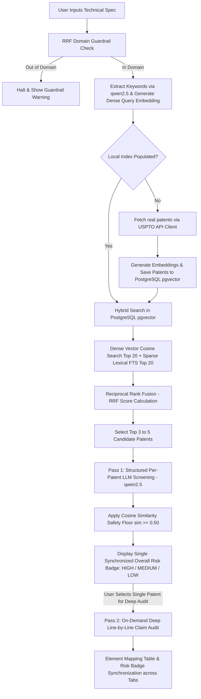

# 📜 Software & AI Patent Infringement Auditor: Complete System Architecture & Workflow

This document details the exact technical architecture, data handling, search mechanisms, and multi-pass RAG workflow for the **Software & AI Patent Infringement Auditor**.

---

## 🏛️ 1. System Overview & Domain Scope

The **Software & AI Patent Infringement Auditor** helps software engineers and legal teams cross-reference proprietary software architecture specifications against **USPTO Patent Claims** to evaluate patent infringement risks and generate technical design-around strategies.

### Domain Scope
The vector space and patent repository are strictly restricted to **Software, Artificial Intelligence, and Cloud Infrastructure Patents**:
- **Software Engineering**: Dependency injection, microservices, PII redaction, API security.
- **Artificial Intelligence & ML**: Distributed GPU neural network optimization, federated learning, attention models, autoencoders.
- **Infrastructure & DBs**: Vector database indexing (HNSW), token bucket rate-limiters, message queues, homomorphic key rotation.

---

## 🏗️ 2. System Architecture & Flow Diagram



---

## 🔄 3. Detailed Step-by-Step Processing Pipeline

### Step 1: Input & RRF Domain Guardrail Check
- **Location**: `src/rag.py` (`verify_query_guardrail()`) & `app.py`
- **Process**:
  1. User enters their software architecture or system design specification into Streamlit.
  2. The guardrail evaluates the candidate Reciprocal Rank Fusion (RRF) scores (`top_score < 0.018`).
  3. **Action**: If out-of-domain (completely unrelated queries like mechanical or chemical specs), execution halts before calling the LLM to prevent false results and conserve compute.

---

### Step 2: In-Memory Query Embedding & Keyword Extraction
- **Locations**: `src/ingest.py` (`generate_embedding()`, `get_embedder()`) & `src/rag.py` (`extract_keywords_from_design_doc()`)
- **Process**:
  1. **Query Embedding**: The user design spec is encoded by `BAAI/bge-small-en-v1.5` to generate a 384-dimensional dense vector in memory.
  2. **Keyword Extraction**: `qwen2.5:latest` extracts 3 to 4 core technical search terms (*e.g., `["vector database", "rate limiter", "neural network"]`*).

---

### Step 3: Index Verification & Optional USPTO Ingestion
- **Locations**: `src/search.py`, `src/api_client.py`, `src/db.py`
- **Process**:
  1. The system checks if the local vector store (PostgreSQL `patent_claims` table or in-memory fallback) contains indexed patents.
  2. **If Index Empty**: Calls USPTO PatentsView REST API, generates claim embeddings, and inserts records into PostgreSQL along with `tsvector` columns.
  3. **If Index Exists**: Skips API calls and executes search locally.

---

### Step 4: Hybrid Search & Reciprocal Rank Fusion (RRF)
- **Location**: `src/db.py` (`PatentVectorStore.hybrid_search()`)
- **Process**:
  1. **Dense Vector Search**: Computes cosine distance (`<=>`) between query embedding and stored patent claim embeddings. Retrieves top 20 dense candidates.
  2. **Sparse Lexical Search**: Runs PostgreSQL Full-Text Search (`tsvector` & `ts_rank`) matching query terms against claim text. Retrieves top 20 sparse candidates.
  3. **RRF Ranking**: Merges both candidate lists using Reciprocal Rank Fusion ($k=60$):
     \[
     RRF\_Score(d) = \sum_{m \in \{dense, sparse\}} \frac{1}{60 + r_m(d)}
     \]
  4. Top candidate patents are selected for Pass 1 LLM evaluation.

---

### Step 5: Pass 1 — High-Level Infringement Screening & Two-Layer Safety Net
- **Location**: `src/rag.py` (`audit_patent_infringement()`)
- **Process**:
  1. **Layer 1 (Structured Prompt)**: Surfacing per-patent `Claim Text` explicitly in the user prompt alongside Doctrine of Equivalents instructions.
  2. **LLM Audit**: `qwen2.5:latest` evaluates technical mechanism equivalence.
  3. **Layer 2 (Cosine Similarity Floor - `apply_semantic_floor`)**: Programmatically computes cosine similarity between the design spec embedding and each patent's claim text embedding. Any patent scoring $\ge 0.50$ is automatically upgraded from `LOW` → `MEDIUM` risk.
  4. **Single Overall Risk Badge Calculation**: The overall risk badge is programmatically calculated (`HIGH` if any patent is `HIGH`, `MEDIUM` if any is `MEDIUM`).

---

### Step 6: Pass 2 — On-Demand Deep Line-by-Line Single Patent Audit
- **Location**: `src/rag.py` (`audit_patent_claims_pass2()`, `sync_pass2_risk_to_report()`) & `app.py` (Tab 2)
- **Process**:
  1. User selects a single specific patent from a dropdown menu in Tab 2.
  2. `qwen2.5:latest` performs an element-by-element legal mapping comparing Independent Claim 1 against design features.
  3. **Risk Synchronization (`sync_pass2_risk_to_report`)**: Pass 2 deep audit results automatically update the individual patent badge in Tab 1 and recalculate the overall top risk badge across the entire app.

---

## 🛠️ 4. File Structure & Responsibilities

| File Path | Description / Primary Responsibility |
| :--- | :--- |
| **`app.py`** | Streamlit Web UI rendering Pass 1, single-patent Pass 2 audit, raw claim viewer, and synchronized risk badges. |
| **`src/rag.py`** | Core RAG pipeline, domain guardrail check, Ollama startup, Pass 1 & Pass 2 LLM prompts, Cosine Floor safety net, and badge synchronization. |
| **`src/search.py`** | Search Engine layer handling hybrid retrieval execution and keyword API fallback. |
| **`src/db.py`** | `PatentVectorStore` managing PostgreSQL + `pgvector` database storage, hybrid search, and RRF rank fusion. |
| **`src/ingest.py`** | Embedding generation (`BAAI/bge-small-en-v1.5`), `get_embedder()` singleton, and vector store ingestion. |
| **`src/api_client.py`** | USPTO PatentsView REST API integration with local JSON disk caching. |
| **`src/eval.py`** | Offline benchmark evaluation script calculating Hit Rate@3 (100%) and MRR (1.0). |

---

## 🚀 5. How to Run the Application

```powershell
# Launch Streamlit app
.\venv\Scripts\python -m streamlit run app.py
```
App URL: **`http://localhost:8501`**
```
App URL: **`http://localhost:8501`**
